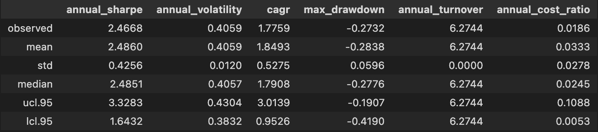
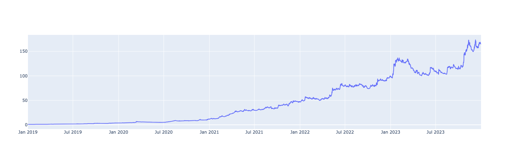
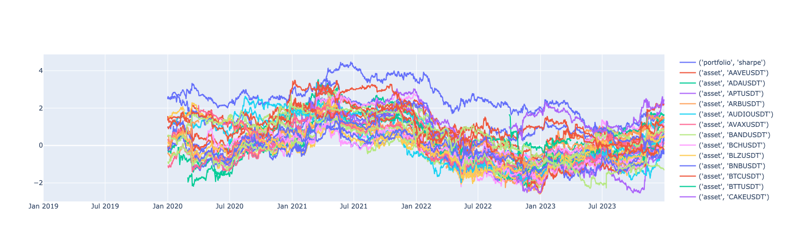

>**Disclaimer**
>
>The content provided in this project is for informational purposes only and does not constitute financial advice. This information should not be construed as professional financial advice, and it is recommended to consult with a qualified financial advisor before making any financial decisions.
>
>No liability is accepted for any losses or damages incurred as a result of acting or refraining from action based on the information provided in this project. Use this information at your own risk.
>

```
          $$\           $$\                                               
          $$ |          $$ |                                              
 $$$$$$\  $$ | $$$$$$\  $$$$$$$\   $$$$$$\ $$\    $$\  $$$$$$\   $$$$$$$\ 
 \____$$\ $$ |$$  __$$\ $$  __$$\  \____$$\\$$\  $$  |$$  __$$\ $$  _____|
 $$$$$$$ |$$ |$$ /  $$ |$$ |  $$ | $$$$$$$ |\$$\$$  / $$$$$$$$ |$$ /      
$$  __$$ |$$ |$$ |  $$ |$$ |  $$ |$$  __$$ | \$$$  /  $$   ____|$$ |      
\$$$$$$$ |$$ |$$$$$$$  |$$ |  $$ |\$$$$$$$ |  \$  /   \$$$$$$$\ \$$$$$$$\ 
 \_______|\__|$$  ____/ \__|  \__| \_______|   \_/     \_______| \_______|
              $$ |                                                        
              $$ |                                                        
              \__|                                                                                                         
```

Alphavec is a lightning fast, minimalist, cost-aware vectorized backtest engine inspired by https://github.com/Robot-Wealth/rsims.

The backtest input is the natural output of a typical quant research process - a time series of portfolio weights. You simply provide a dataframe of weights and a dataframe of prices, along with some optional cost parameters and the backtest returns a streamlined performance report with insight into the key metrics of sharpe, volatility, CAGR, drawdown et al.

Thanks to the speed offered by vectorization, the observed portfolio performance metrics are automatically complemented with bootstrapped (n = 1000) estimations of upper and lower confidence limits. This gives a deeper insight into the potential future variance in outcomes for your strategy.

## Rationale

Alphavec is an antidote to the various bloated and complex backtest frameworks.

To validate ideas all you really need is...

```python

weights * returns.shift(-1)
```

The goal was to add just enough extra complexity to this basic formula to support sound development of cost-aware systematic trading strategies.

## Install

```
pip install alphavec
```

## Usage

See the notebook [alphavec.ipynb](alphavec.ipynb) for a walkthrough of designing and testing a rudimentary strategy using Alphavec.

```python

from functools import partial
import alphavec as av

prices = load_daily_crypto_close_prices()
weights = generate_strategy_weights()

results = av.backtest(
    weights,
    prices,
    freq_day=1,  # 1 for daily price periods
    trading_days_year=365,  # 365 for a 24/7 market such as crypto
    lags=1,  # lag prices 1 period for close prices
    commission_func=partial(
        av.pct_commission, fee=0.001
    ),  # 0.1% fee on each trade
    spread_pct=0.0005,  # 0.05% spread on each trade
    ann_borrow_rate=0.05,  # 5% annual borrowing rate for leveraged positions
    is_perp_funding=True, # apply ann_borrow_rate as an effective funding rate 
    ann_risk_free_rate=0,  # 0% risk free rate used to calculate Sharpe ratio
    bootstrap_n=1000,  # 1000 bootstrap iterations to calculate confidence intervals
)

```

## Example Results

### Performance Table

Bootstrapped estimators of the performance distribution give deeper insight into the expected real-world results.



### Equity Curve


### Rolling Sharpe
